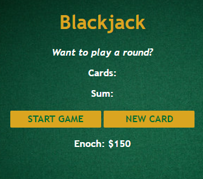
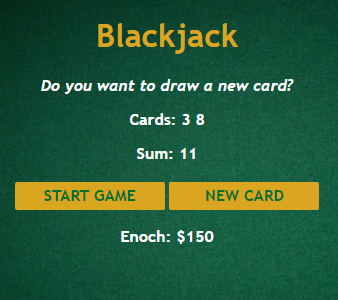

#Blackjack Game

## Summary
Part 2 of learning JavaScript through building things. It is January 3, 2022 at 12:03 A.M.. This time, I built a small JavaScript game. Essentially, it is a random number generator that deals you cards in the form of numbers and you try to hit 21. Nothing too fancy, just more exposure to building things from the ground up with HTML, CSS, and JavaScript. 

## What Did I Learn? 
* Arrays
* Objects
* Booleans
* if else statements
* Comparison Operators
* Logical Operators
* for loops
* Math object
* return statements

.png)